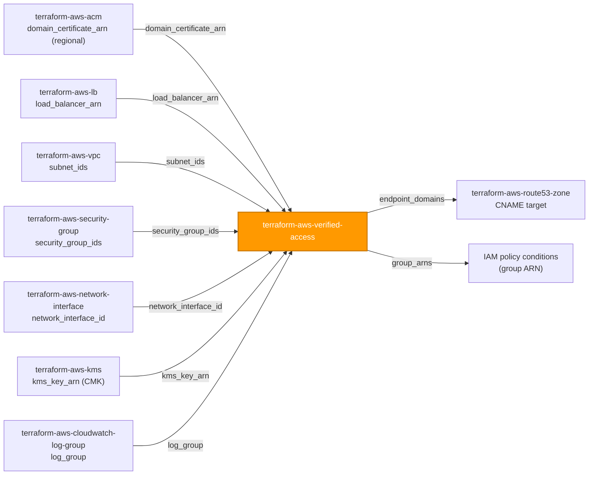
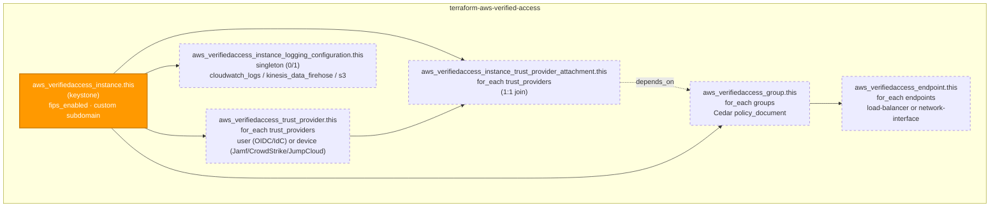

# 🟧 AWS **Verified Access (Zero Trust Network Access)** Terraform Module

> **Provisions a complete AWS Verified Access Zero Trust boundary — instance, identity/device trust provider(s), the instance attachment, Cedar-policy-gated group(s), and per-application endpoint(s) — with instance access logging on by default, replacing a traditional corporate VPN for private application access.** Built for the AWS provider **v6.x**.

[](https://www.terraform.io)
[](https://registry.terraform.io/providers/hashicorp/aws/latest)
[](#)
[](#)
[](#)

---

## 🧩 Overview

- 🔒 **One instance, fully wired.** Creates `aws_verifiedaccess_instance` plus everything meaningless without it: trust provider(s) (identity and/or device), the instance-to-trust-provider attachment(s), Cedar-policy access group(s), and per-application endpoint(s).
- 🧑‍💻 **Identity AND device trust.** Each `trust_providers` entry is `user` (OIDC or IAM Identity Center) or `device` (Jamf, CrowdStrike, or JumpCloud) — mix both to require a compliant device *and* an authenticated user before granting access.
- 🚫 **Fail-closed by design.** AWS's own Verified Access behavior denies access when a group/endpoint has no `policy_document` — this module relies on that native default rather than re-implementing a synthetic "deny all," so there is no accidental "wide open" starting state.
- 🪵 **Access logging on by default.** `logging_configuration.enabled = true` forces an explicit choice: wire a CloudWatch Logs / Kinesis Data Firehose / S3 destination, or consciously opt out — mirroring `terraform-aws-lb`'s `access_logs` pattern. `include_trust_context = true` bakes device/identity claims into every log line for investigative auditability.
- 🌐 **Two application-facing endpoint patterns.** `endpoint_type = "load-balancer"` fronts an ALB (wire from `terraform-aws-lb`); `endpoint_type = "network-interface"` fronts a single ENI (wire from `terraform-aws-network-interface`). `cidr`/`rds` endpoint variants exist in the live schema but are a documented, deliberate out-of-scope for this module today.
- 🔑 **Cedar policies, not IAM JSON.** `policy_document` on both groups and endpoints is Cedar — the same language behind Amazon Verified Permissions. Terraform cannot lint Cedar; validate every policy in the AWS console policy validator before applying.
- 🧱 **Deeply-typed, key-addressed children.** Trust providers, groups, and endpoints are each `map(object(...))` keyed by a stable caller string — endpoints resolve to a group *by key* (`verified_access_group_key`), and trust-provider attachments are rendered 1:1 from the same keys as `trust_providers`, so there is no manual ARN/ID threading.
- 🏷️ **Tags everywhere taggable.** `var.tags` merges with provider `default_tags`, flows to the instance, trust providers, groups, and endpoints, and is surfaced as `tags_all`. (The instance-trust-provider attachment and the logging configuration are **not** taggable — AWS limitation.)

> 💡 **Why it matters:** Verified Access is the front door for internal applications that used to sit behind a VPN — every request is evaluated against an explicit Cedar policy backed by real identity and/or device trust signal, and every decision is logged. A single secure-by-default module keeps fail-closed policy evaluation, encryption-at-rest options, and access logging consistent, so the blast radius of a misconfigured Zero Trust boundary (an accidentally open policy, logging off) is closed by default, not by review.

---

## ❤️ Support this project

If these Terraform modules have been helpful to you or your organization, I'd appreciate your support in any of the following ways:

- ⭐ **Star this repository** to help others discover this Terraform module.
- 🤝 **Connect with me on LinkedIn:** [linkedin.com/in/microsoftexpert](https://www.linkedin.com/in/microsoftexpert)
- ☕ **Buy me a coffee:** [buymeacoffee.com/microsoftexpert](https://buymeacoffee.com/microsoftexpert)

Whether it's a star, a professional connection, or a coffee, every gesture helps keep these modules actively maintained and continually improving. Thank you for being part of the community!

---

## 🗺️ Where this fits in the family

`terraform-aws-verified-access` sits at the network-access **edge** — it consumes ACM, VPC/security-group, KMS, ALB, ENI, and log-destination inputs from upstream siblings, and feeds DNS (CNAME target) and IAM policy conditions downstream. Nothing in the Phase 1-7 catalog depends on it structurally, the same terminal position CloudFront and WAFv2 occupy.



---

## 🧬 What this module builds



| Resource | Count | Created when |
|---|---|---|
| `aws_verifiedaccess_instance.this` | 1 | always (keystone) |
| `aws_verifiedaccess_trust_provider.this` | 0..N | one per `trust_providers` entry |
| `aws_verifiedaccess_instance_trust_provider_attachment.this` | 0..N | one per `trust_providers` entry (1:1) |
| `aws_verifiedaccess_group.this` | 0..N | one per `groups` entry |
| `aws_verifiedaccess_endpoint.this` | 0..N | one per `endpoints` entry |
| `aws_verifiedaccess_instance_logging_configuration.this` | 0 or 1 | rendered unless `logging_configuration.enabled = false` |

Endpoints resolve to a group by **key** (`verified_access_group_key`); trust-provider attachments are rendered from the **same keys** as `trust_providers` — no manual ARN/ID threading between children. Groups and endpoints both `depends_on` the full attachment resource so Terraform always attaches trust providers before anything that relies on them for Cedar evaluation.

---

## ✅ Provider / Versions

| Requirement | Version |
|---|---|
| Terraform | `>= 1.12.0` |
| `hashicorp/aws` | `>= 6.0, < 7.0` |

The module declares only a `required_providers` block (`providers.tf`) and inherits the single `aws` provider — there is **no `provider {}` block**, **no `region` variable**, and **no credential variable**. Credentials resolve through the standard AWS chain at the root/pipeline level (env vars → SSO/shared credentials → `assume_role` → instance profile / IRSA → OIDC web identity). The **caller** chooses the Region by which provider configuration it passes into the `aws` slot.

> ℹ️ Verified Access is a **regional** service with **no us-east-1 coupling** (unlike CloudFront/WAFv2-CLOUDFRONT/ACM-for-CloudFront). The ACM certificate wired into `domain_certificate_arn` must be a regional cert in the **same Region** as this module.

---

## 🔑 Required IAM Permissions

Least-privilege actions the **Terraform execution identity** needs. Verified Access has **no dedicated IAM service prefix** — every action lives under `ec2:` (a quirk it shares with Transit Gateway).

| Action | Required for | Notes |
|---|---|---|
| `ec2:CreateVerifiedAccessInstance`, `ec2:DeleteVerifiedAccessInstance`, `ec2:DescribeVerifiedAccessInstances`, `ec2:ModifyVerifiedAccessInstance` | Instance lifecycle | Core CRUD on the keystone |
| `ec2:CreateVerifiedAccessTrustProvider`, `ec2:DeleteVerifiedAccessTrustProvider`, `ec2:DescribeVerifiedAccessTrustProviders`, `ec2:ModifyVerifiedAccessTrustProvider` | Trust-provider lifecycle | Only when `trust_providers` set |
| `ec2:AttachVerifiedAccessTrustProvider`, `ec2:DetachVerifiedAccessTrustProvider` | Instance ↔ trust-provider attachment | One call per `trust_providers` entry |
| `ec2:CreateVerifiedAccessGroup`, `ec2:DeleteVerifiedAccessGroup`, `ec2:DescribeVerifiedAccessGroups`, `ec2:ModifyVerifiedAccessGroupPolicy`, `ec2:ModifyVerifiedAccessGroup` | Group + Cedar policy lifecycle | Only when `groups` set |
| `ec2:CreateVerifiedAccessEndpoint`, `ec2:DeleteVerifiedAccessEndpoint`, `ec2:DescribeVerifiedAccessEndpoints`, `ec2:ModifyVerifiedAccessEndpointPolicy`, `ec2:ModifyVerifiedAccessEndpoint` | Endpoint lifecycle + Cedar policy | Only when `endpoints` set |
| `ec2:ModifyVerifiedAccessInstanceLoggingConfiguration`, `ec2:DescribeVerifiedAccessInstanceLoggingConfigurations` | Access-log wiring | Rendered unless `logging_configuration.enabled = false` |
| `ec2:CreateTags`, `ec2:DeleteTags`, `ec2:DescribeTags` | Tagging | Instance, trust providers, groups, endpoints |
| `kms:DescribeKey`, `kms:CreateGrant` | CMK-encrypted resources | Only when `sse_configuration`/`sse_specification.kms_key_arn` is supplied |
| `elasticloadbalancing:DescribeLoadBalancers` | Resolving `load_balancer_arn` | `load-balancer` endpoints only |
| `ec2:DescribeNetworkInterfaces` | Resolving `network_interface_id` | `network-interface` endpoints only |
| `acm:DescribeCertificate` | Resolving `domain_certificate_arn` | Both supported endpoint types |

> 🔒 No `iam:PassRole` is required — Verified Access does not assume a service role on the caller's behalf for any resource in this module, and **no service-linked role** is required for Verified Access itself.

---

## 📋 AWS Prerequisites

- **Identity trust provider must exist before it is useful.** For `user_trust_provider_type = "oidc"`, an OIDC-compliant IdP (Okta, Azure AD, Ping, etc.) must already expose `authorization_endpoint`/`token_endpoint`/`user_info_endpoint` and a registered `client_id`/`client_secret` **before** `terraform apply`. For `"iam-identity-center"`, IAM Identity Center must already be enabled for the account/Organization.
- **Device trust provider must exist before it is useful.** Jamf, CrowdStrike, or JumpCloud must already have their AWS Verified Access integration configured (tenant enrolled, `tenant_id` issued) before `device_options.tenant_id` is wired in — this module does not configure the vendor side.
- **Cedar policy language.** `policy_document` on both groups and endpoints is Cedar, not IAM JSON. Test policies in the Verified Access / Verified Permissions console policy validator (or the `cedar` CLI) before committing them here — a syntactically valid but semantically wrong policy still applies cleanly.
- **No region constraint.** Verified Access is regional; there is no us-east-1 requirement (unlike CloudFront/WAFv2/ACM-for-CloudFront).
- **Quotas** (soft, raisable via Service Quotas): 10 Verified Access instances per account/Region; 5 trust providers per instance; 10 groups per instance; 150 endpoints per instance.
- **DNS delegation.** The generated `endpoint_domain` needs a CNAME from the caller's own `application_domain` — provisioned in `terraform-aws-route53-zone`, not here.

---

## 📁 Module Structure

```
terraform-aws-verified-access/
├── providers.tf # required_providers (aws >= 6.0, < 7.0); region/provider wiring notes; no provider block
├── variables.tf # instance identity → trust_providers → groups → endpoints → logging_configuration → tags → timeouts
├── main.tf # aws_verifiedaccess_instance.this + trust_provider / attachment / group / endpoint / logging_configuration for_each
├── outputs.tf # id (+ group_arns) + child-collection maps + tags_all
├── README.md # this file
└── SCOPE.md # in/out-of-scope, IAM permissions, prerequisites, gotchas
```

---

## ⚙️ Quick Start

Smallest working call — an OIDC-trusted instance fronting one internal application via an ALB endpoint:

```hcl
module "verified_access" {
  source = "git::https://github.com/microsoftexpert/terraform-aws-verified-access?ref=v1.0.0"

  instance_description = "core-ztna"

  trust_providers = {
    okta = {
      policy_reference_name    = "okta"
      trust_provider_type      = "user"
      user_trust_provider_type = "oidc"
      oidc_options = {
        issuer                 = "https://example.okta.com"
        authorization_endpoint = "https://example.okta.com/oauth2/v1/authorize"
        token_endpoint         = "https://example.okta.com/oauth2/v1/token"
        user_info_endpoint     = "https://example.okta.com/oauth2/v1/userinfo"
        client_id              = var.okta_client_id
        client_secret          = var.okta_client_secret # sensitive at the provider-schema level
        scope                  = "openid profile email"
      }
    }
  }

  groups = {
    internal_app = {
      description     = "Internal app — authenticated Okta users only"
      policy_document = <<-CEDAR
 permit(principal, action, resource)
 when { context.okta.claims.email_verified == true };
 CEDAR
    }
  }

  endpoints = {
    app = {
      endpoint_type             = "load-balancer"
      application_domain        = "app.internal.example.com"
      domain_certificate_arn    = module.cert.arn # from terraform-aws-acm (regional)
      endpoint_domain_prefix    = "app"
      security_group_ids        = [module.va_endpoint_sg.id] # from terraform-aws-security-group
      verified_access_group_key = "internal_app"
      load_balancer_options = {
        load_balancer_arn = module.alb.arn # from terraform-aws-lb
        port              = 443
        subnet_ids        = module.vpc.private_subnet_ids # from terraform-aws-vpc
      }
    }
  }

  # logging_configuration.enabled = true by default — a destination is required
  logging_configuration = {
    cloudwatch_logs = { log_group = module.va_log_group.name } # from terraform-aws-cloudwatch-log-group
  }

  tags = { Environment = "prod", DataClass = "internal" }
}
```

---

## 🔌 Cross-Module Contract

### Consumes

| Input | Type | Source module |
|---|---|---|
| `endpoints[*].load_balancer_options.load_balancer_arn` | `string` (ALB ARN) | `terraform-aws-lb` |
| `endpoints[*].load_balancer_options.subnet_ids` | `list(string)` | `terraform-aws-vpc` |
| `endpoints[*].network_interface_options.network_interface_id` | `string` (ENI id) | `terraform-aws-network-interface` |
| `endpoints[*].domain_certificate_arn` | `string` (ACM cert ARN, **regional**) | `terraform-aws-acm` |
| `endpoints[*].security_group_ids` | `list(string)` | `terraform-aws-security-group` |
| `*.sse_configuration`/`sse_specification.kms_key_arn` | `string` (CMK ARN) | `terraform-aws-kms` |
| `logging_configuration.cloudwatch_logs.log_group` | `string` | `terraform-aws-cloudwatch-log-group` |

### Emits

| Output | Description | Consumed by |
|---|---|---|
| `id` | Verified Access instance id | cross-module reference, `logging_configuration` |
| `creation_time` / `last_updated_time` | Instance lifecycle timestamps | audit |
| `name_servers` | Instance-level name servers backing CIDR endpoints | DNS diagnostics |
| `trust_provider_ids` | Map of trust-provider key → id | attachment wiring, audit |
| `group_ids` | Map of group key → id | endpoint wiring |
| `group_arns` | Map of group key → ARN (`verifiedaccess_group_arn`) | `terraform-aws-kms` grant scoping, IAM policy conditions |
| `endpoint_ids` | Map of endpoint key → id | audit, DNS automation |
| `endpoint_domains` | Map of endpoint key → generated `endpoint_domain` | `terraform-aws-route53-zone` (CNAME target) |
| `endpoint_device_validation_domains` | Map of endpoint key → device-validation domain (null unless a device trust provider is attached) | device-trust vendor DNS validation |
| `tags_all` | All tags incl. provider `default_tags` (resource tags win) | governance/audit |

> ℹ️ **No module-level `arn` output.** `aws_verifiedaccess_instance`, `aws_verifiedaccess_trust_provider`, and `aws_verifiedaccess_endpoint` expose **no ARN attribute at all** in the current provider schema — only `aws_verifiedaccess_group` does (`verifiedaccess_group_arn`, surfaced as `group_arns`). See Architecture Notes.

---

## 📚 Example Library

<details>
<summary><strong>1 · Minimal instance with an OIDC trust provider and an ALB endpoint</strong></summary>

```hcl
module "verified_access" {
  source = "git::https://github.com/microsoftexpert/terraform-aws-verified-access?ref=v1.0.0"

  trust_providers = {
    okta = {
      policy_reference_name    = "okta"
      trust_provider_type      = "user"
      user_trust_provider_type = "oidc"
      oidc_options = {
        issuer                 = "https://example.okta.com"
        authorization_endpoint = "https://example.okta.com/oauth2/v1/authorize"
        token_endpoint         = "https://example.okta.com/oauth2/v1/token"
        user_info_endpoint     = "https://example.okta.com/oauth2/v1/userinfo"
        client_id              = var.okta_client_id
        client_secret          = var.okta_client_secret
      }
    }
  }

  groups = {
    app = { policy_document = "permit(principal, action, resource);" }
  }

  endpoints = {
    app = {
      endpoint_type             = "load-balancer"
      application_domain        = "app.internal.example.com"
      domain_certificate_arn    = module.cert.arn
      endpoint_domain_prefix    = "app"
      security_group_ids        = [module.va_endpoint_sg.id]
      verified_access_group_key = "app"
      load_balancer_options     = { load_balancer_arn = module.alb.arn, port = 443, subnet_ids = module.vpc.private_subnet_ids }
    }
  }

  logging_configuration = { cloudwatch_logs = { log_group = module.va_log_group.name } }
}
```
</details>

<details>
<summary><strong>2 · IAM Identity Center trust provider (no OIDC secrets to manage)</strong></summary>

```hcl
module "verified_access" {
  source = "git::https://github.com/microsoftexpert/terraform-aws-verified-access?ref=v1.0.0"

  trust_providers = {
    idc = {
      policy_reference_name    = "idc"
      trust_provider_type      = "user"
      user_trust_provider_type = "iam-identity-center"
      # IAM Identity Center must already be enabled for this account/Organization
    }
  }

  groups = {
    finance_app = {
      policy_document = <<-CEDAR
 permit(principal, action, resource)
 when { context.idc.groups.contains("finance-analysts") };
 CEDAR
    }
  }

  endpoints = {
    finance = {
      endpoint_type             = "network-interface"
      application_domain        = "finance.internal.example.com"
      domain_certificate_arn    = module.cert.arn
      endpoint_domain_prefix    = "finance"
      security_group_ids        = [module.va_endpoint_sg.id]
      verified_access_group_key = "finance_app"
      network_interface_options = { network_interface_id = module.eni.id, port = 443 }
    }
  }

  logging_configuration = { cloudwatch_logs = { log_group = module.va_log_group.name } }
}
```
</details>

<details>
<summary><strong>3 · Device trust provider (Jamf) combined with an identity trust provider</strong></summary>

```hcl
module "verified_access" {
  source = "git::https://github.com/microsoftexpert/terraform-aws-verified-access?ref=v1.0.0"

  trust_providers = {
    okta = {
      policy_reference_name    = "okta"
      trust_provider_type      = "user"
      user_trust_provider_type = "oidc"
      oidc_options = {
        issuer         = "https://example.okta.com", authorization_endpoint = "https://example.okta.com/oauth2/v1/authorize"
        token_endpoint = "https://example.okta.com/oauth2/v1/token", user_info_endpoint = "https://example.okta.com/oauth2/v1/userinfo"
        client_id      = var.okta_client_id, client_secret = var.okta_client_secret
      }
    }
    jamf = {
      policy_reference_name      = "jamf"
      trust_provider_type        = "device"
      device_trust_provider_type = "jamf"
      device_options             = { tenant_id = var.jamf_tenant_id } # issued when Jamf's VA integration was configured
    }
  }

  groups = {
    managed_devices_only = {
      policy_document = <<-CEDAR
 permit(principal, action, resource)
 when {
 context has "jamf" &&
 ["LOW", "NOT_APPLICABLE", "MEDIUM", "SECURE"].contains(context.jamf.risk)
 };
 CEDAR
    }
  }

  endpoints = {
    app = {
      endpoint_type             = "load-balancer"
      application_domain        = "secure.internal.example.com"
      domain_certificate_arn    = module.cert.arn
      endpoint_domain_prefix    = "secure"
      security_group_ids        = [module.va_endpoint_sg.id]
      verified_access_group_key = "managed_devices_only"
      load_balancer_options     = { load_balancer_arn = module.alb.arn, port = 443, subnet_ids = module.vpc.private_subnet_ids }
    }
  }

  logging_configuration = { include_trust_context = true, cloudwatch_logs = { log_group = module.va_log_group.name } }
}
```
</details>

<details>
<summary><strong>4 · ALB-backed endpoint (endpoint_type = "load-balancer")</strong></summary>

```hcl
endpoints = {
  web = {
    endpoint_type             = "load-balancer"
    application_domain        = "web.internal.example.com"
    domain_certificate_arn    = module.cert.arn
    endpoint_domain_prefix    = "web"
    security_group_ids        = [module.va_endpoint_sg.id]
    verified_access_group_key = "web_users"
    load_balancer_options = {
      load_balancer_arn = module.alb.arn
      port              = 443
      protocol          = "https"
      subnet_ids        = module.vpc.private_subnet_ids
    }
  }
}
```
</details>

<details>
<summary><strong>5 · ENI-backed endpoint (endpoint_type = "network-interface")</strong></summary>

```hcl
endpoints = {
  legacy_app = {
    endpoint_type             = "network-interface"
    application_domain        = "legacy.internal.example.com"
    domain_certificate_arn    = module.cert.arn
    endpoint_domain_prefix    = "legacy"
    security_group_ids        = [module.va_endpoint_sg.id]
    verified_access_group_key = "legacy_users"
    network_interface_options = {
      network_interface_id = module.eni.id
      port                 = 8443
      protocol             = "https"
    }
  }
}
```
</details>

<details>
<summary><strong>6 · Least-privilege Cedar policy example (group-level, condition-only)</strong></summary>

```hcl
groups = {
  restricted = {
    description     = "Only verified corporate email domains, MFA'd within the last hour"
    policy_document = <<-CEDAR
 permit(principal, action, resource)
 when {
 context.okta.claims.email_verified == true &&
 context.okta.claims.email like "*@example.com" &&
 context.okta.claims.auth_time > (context.okta.claims.iat - 3600)
 };
 CEDAR
  }
}
# NOTE: principal/action/resource stay undefined per AWS's Cedar dialect for
# Verified Access — only the `when`/`unless` condition clause references `context`.
# Validate this policy in the AWS console's Verified Access policy validator
# before applying; Terraform cannot lint Cedar syntax or semantics.
```
</details>

<details>
<summary><strong>7 · Endpoint-level policy layered on top of the group policy</strong></summary>

```hcl
endpoints = {
  admin_console = {
    endpoint_type             = "load-balancer"
    application_domain        = "admin.internal.example.com"
    domain_certificate_arn    = module.cert.arn
    endpoint_domain_prefix    = "admin"
    security_group_ids        = [module.va_endpoint_sg.id]
    verified_access_group_key = "internal_app" # broader group policy
    load_balancer_options     = { load_balancer_arn = module.alb.arn, port = 443, subnet_ids = module.vpc.private_subnet_ids }
    policy_document           = <<-CEDAR
 permit(principal, action, resource)
 when { context.okta.groups.contains("platform-admins") };
 CEDAR
  }
}
```
</details>

<details>
<summary><strong>8 · Customer-managed KMS key on the group's Cedar policy (encryption at rest)</strong></summary>

```hcl
module "kms" {
  source      = "git::https://github.com/microsoftexpert/terraform-aws-kms?ref=v1.0.0"
  description = "CMK for Verified Access group policies"
}

groups = {
  internal_app = {
    policy_document = "permit(principal, action, resource) when { context.okta.claims.email_verified == true };"
    sse_configuration = {
      customer_managed_key_enabled = true
      kms_key_arn                  = module.kms.arn
    }
  }
}
```
</details>

<details>
<summary><strong>9 · Customer-managed KMS key on the trust provider's OIDC secrets and the endpoint's Cedar policy</strong></summary>

```hcl
trust_providers = {
  okta = {
    policy_reference_name    = "okta"
    trust_provider_type      = "user"
    user_trust_provider_type = "oidc"
    oidc_options             = { issuer = "https://example.okta.com", client_id = var.okta_client_id, client_secret = var.okta_client_secret }
    sse_specification        = { customer_managed_key_enabled = true, kms_key_arn = module.kms.arn }
  }
}

endpoints = {
  app = {
    endpoint_type             = "load-balancer"
    application_domain        = "app.internal.example.com"
    domain_certificate_arn    = module.cert.arn
    endpoint_domain_prefix    = "app"
    verified_access_group_key = "internal_app"
    load_balancer_options     = { load_balancer_arn = module.alb.arn, port = 443, subnet_ids = module.vpc.private_subnet_ids }
    sse_specification         = { customer_managed_key_enabled = true, kms_key_arn = module.kms.arn }
  }
}
```
</details>

<details>
<summary><strong>10 · Secure-by-default opt-out — disable instance access logging (discouraged)</strong></summary>

```hcl
module "verified_access" {
  source = "git::https://github.com/microsoftexpert/terraform-aws-verified-access?ref=v1.0.0"

  trust_providers = { okta = { policy_reference_name = "okta", trust_provider_type = "user", user_trust_provider_type = "oidc" } }
  groups          = { app = { policy_document = "permit(principal, action, resource);" } }
  endpoints = {
    app = {
      endpoint_type             = "load-balancer", application_domain = "app.internal.example.com"
      domain_certificate_arn    = module.cert.arn, endpoint_domain_prefix = "app"
      verified_access_group_key = "app"
      load_balancer_options     = { load_balancer_arn = module.alb.arn, port = 443, subnet_ids = module.vpc.private_subnet_ids }
    }
  }

  # DOCUMENTED OPT-OUT: removes the only audit trail of ZTNA access decisions.
  logging_configuration = { enabled = false }
}
```
</details>

<details>
<summary><strong>11 · Multiple trust providers + multiple groups + multiple endpoints (for_each pattern)</strong></summary>

```hcl
trust_providers = {
  okta        = { policy_reference_name = "okta", trust_provider_type = "user", user_trust_provider_type = "oidc", oidc_options = { issuer = "https://example.okta.com" } }
  crowdstrike = { policy_reference_name = "crowdstrike", trust_provider_type = "device", device_trust_provider_type = "crowdstrike", device_options = { tenant_id = var.crowdstrike_tenant_id } }
}

groups = {
  finance = { policy_document = "permit(principal, action, resource) when { context.okta.groups.contains(\"finance\") };" }
  eng     = { policy_document = "permit(principal, action, resource) when { context.okta.groups.contains(\"engineering\") };" }
}

endpoints = {
  finance_app = {
    endpoint_type             = "load-balancer", application_domain = "finance.internal.example.com"
    domain_certificate_arn    = module.cert.arn, endpoint_domain_prefix = "finance"
    verified_access_group_key = "finance"
    load_balancer_options     = { load_balancer_arn = module.finance_alb.arn, port = 443, subnet_ids = module.vpc.private_subnet_ids }
  }
  eng_app = {
    endpoint_type             = "load-balancer", application_domain = "eng.internal.example.com"
    domain_certificate_arn    = module.cert.arn, endpoint_domain_prefix = "eng"
    verified_access_group_key = "eng"
    load_balancer_options     = { load_balancer_arn = module.eng_alb.arn, port = 443, subnet_ids = module.vpc.private_subnet_ids }
  }
}
```
</details>

<details>
<summary><strong>12 · Tags (merge with provider <code>default_tags</code>; per-child overrides)</strong></summary>

```hcl
# Caller's provider block owns default_tags; the module never sets it.
provider "aws" {
  default_tags { tags = { Owner = "platform", ManagedBy = "terraform" } }
}

module "verified_access" {
  source = "git::https://github.com/microsoftexpert/terraform-aws-verified-access?ref=v1.0.0"

  trust_providers = {
    okta = { policy_reference_name = "okta", trust_provider_type = "user", user_trust_provider_type = "oidc", tags = { Tier = "identity" } }
  }
  groups = { app = { policy_document = "permit(principal, action, resource);" } }
  endpoints = {
    app = {
      endpoint_type             = "load-balancer", application_domain = "app.internal.example.com"
      domain_certificate_arn    = module.cert.arn, endpoint_domain_prefix = "app"
      verified_access_group_key = "app"
      load_balancer_options     = { load_balancer_arn = module.alb.arn, port = 443, subnet_ids = module.vpc.private_subnet_ids }
    }
  }
  logging_configuration = { cloudwatch_logs = { log_group = module.va_log_group.name } }

  tags = { Environment = "prod", DataClass = "internal" }
}

# module.verified_access.tags_all == { Owner, ManagedBy, Environment, DataClass }
# the "okta" trust provider additionally carries Tier = "identity"
```
</details>

<details>
<summary><strong>13 · Import an existing Verified Access instance</strong></summary>

```hcl
import {
  to = module.verified_access.aws_verifiedaccess_instance.this
  id = "vai-1234567890abcdef0"
}
```
</details>

<details>
<summary><strong>14 · End-to-end composition — VPC + SG + ACM + ALB + CloudWatch Logs + Verified Access + DNS</strong></summary>

```hcl
provider "aws" {} # single regional provider — Verified Access, ALB, and its regional ACM cert share it

module "vpc" {
  source = "git::https://github.com/microsoftexpert/terraform-aws-vpc?ref=v1.0.0"
  name   = "core"
}

module "alb_sg" {
  source = "git::https://github.com/microsoftexpert/terraform-aws-security-group?ref=v1.0.0"
  name   = "core-alb-sg"
  vpc_id = module.vpc.vpc_id
}

module "cert" {
  source      = "git::https://github.com/microsoftexpert/terraform-aws-acm?ref=v1.0.0"
  domain_name = "app.internal.example.com"
}

module "alb" {
  source             = "git::https://github.com/microsoftexpert/terraform-aws-lb?ref=v1.0.0"
  name               = "ztna-app-alb"
  vpc_id             = module.vpc.vpc_id
  subnet_ids         = module.vpc.private_subnet_ids
  security_group_ids = [module.alb_sg.id]
  access_logs        = { enabled = true, bucket = module.log_bucket.bucket }
  target_groups      = { app = { port = 443, protocol = "HTTPS" } }
  listeners = {
    https = { port = 443, certificate_arn = module.cert.arn, default_action = { type = "forward", target_group_key = "app" } }
  }
}

module "va_log_group" {
  source = "git::https://github.com/microsoftexpert/terraform-aws-cloudwatch-log-group?ref=v1.0.0"
  name   = "/verified-access/core-ztna"
}

# This module — the Zero Trust boundary in front of the ALB
module "verified_access" {
  source = "git::https://github.com/microsoftexpert/terraform-aws-verified-access?ref=v1.0.0"

  instance_description = "core-ztna"

  trust_providers = {
    okta = {
      policy_reference_name    = "okta"
      trust_provider_type      = "user"
      user_trust_provider_type = "oidc"
      oidc_options = {
        issuer         = "https://example.okta.com", authorization_endpoint = "https://example.okta.com/oauth2/v1/authorize"
        token_endpoint = "https://example.okta.com/oauth2/v1/token", user_info_endpoint = "https://example.okta.com/oauth2/v1/userinfo"
        client_id      = var.okta_client_id, client_secret = var.okta_client_secret
      }
    }
  }

  groups = {
    internal_app = {
      policy_document = <<-CEDAR
 permit(principal, action, resource)
 when { context.okta.claims.email_verified == true };
 CEDAR
    }
  }

  endpoints = {
    app = {
      endpoint_type             = "load-balancer"
      application_domain        = "app.internal.example.com"
      domain_certificate_arn    = module.cert.arn
      endpoint_domain_prefix    = "app"
      security_group_ids        = [module.alb_sg.id]
      verified_access_group_key = "internal_app"
      load_balancer_options     = { load_balancer_arn = module.alb.arn, port = 443, subnet_ids = module.vpc.private_subnet_ids }
    }
  }

  logging_configuration = { cloudwatch_logs = { log_group = module.va_log_group.name } }

  tags = { Environment = "prod", DataClass = "internal" }
}

# DNS — CNAME the application domain to the generated endpoint_domain
module "dns" {
  source    = "git::https://github.com/microsoftexpert/terraform-aws-route53-zone?ref=v1.0.0"
  zone_name = "internal.example.com"
  records = {
    app = { name = "app", type = "CNAME", ttl = 300, records = [module.verified_access.endpoint_domains["app"]] }
  }
}
```

> ⚠️ The Okta (or other OIDC IdP) tenant, and any Jamf/CrowdStrike/JumpCloud device-trust integration, must be configured out-of-band **before** this apply — this module wires their credentials in but does not provision the vendor side.
</details>

---

## 📥 Inputs (high-level)

**Core (instance)**
- `instance_description` — optional description for the instance.
- `fips_enabled` — FIPS endpoints for the instance. **FORCE-NEW.** Default `false`.
- `cidr_endpoints_custom_subdomain` — custom subdomain for CIDR-type endpoints (out of this module's current endpoint-type scope).

**Trust providers**
- `trust_providers` — `map(object(...))`: `policy_reference_name`, `trust_provider_type` (`user`|`device`), `user_trust_provider_type` (`iam-identity-center`|`oidc`), `device_trust_provider_type` (`jamf`|`jumpcloud`|`crowdstrike`), `device_options`, `oidc_options` (incl. `client_secret`), `native_application_oidc_options`, `sse_specification`, `tags`.

**Groups**
- `groups` — `map(object(...))`: `description`, `policy_document` (Cedar, null = deny-by-default), `sse_configuration`, `tags`.

**Endpoints**
- `endpoints` — `map(object(...))`: `endpoint_type` (`load-balancer`|`network-interface`), `application_domain`, `domain_certificate_arn`, `endpoint_domain_prefix`, `security_group_ids`, `load_balancer_options`, `network_interface_options`, `policy_document`, `sse_specification`, `verified_access_group_key`, `tags`.

**Logging**
- `logging_configuration` — `object`: `enabled` (default `true`), `include_trust_context` (default `true`), `log_version`, `cloudwatch_logs`, `kinesis_data_firehose`, `s3`.

**Encryption (per collection)**
- `trust_providers[*].sse_specification` / `groups[*].sse_configuration` / `endpoints[*].sse_specification` — `{ customer_managed_key_enabled, kms_key_arn }`. `null` uses the AWS-owned key.

**Universal tail**
- `tags` — merged over every taggable resource; merges with provider `default_tags`.
- `timeouts` — applied to trust providers and endpoints (`create`/`update`/`delete`).

> ℹ️ see `variables.tf` for full heredoc schemas.

---

## 🧾 Outputs

- `id` — Verified Access instance id.
- `creation_time` / `last_updated_time` — instance lifecycle timestamps.
- `name_servers` — instance name servers backing CIDR endpoints (informational).
- `trust_provider_ids` — map of trust-provider key → id.
- `group_ids` — map of group key → id.
- `group_arns` — map of group key → ARN (`verifiedaccess_group_arn`) — **the only true ARN this module emits.**
- `group_owners` — map of group key → owning AWS account id.
- `endpoint_ids` — map of endpoint key → id.
- `endpoint_domains` — map of endpoint key → generated `endpoint_domain` (CNAME target).
- `endpoint_device_validation_domains` — map of endpoint key → device-validation domain; conditionally present (`try(..., null)`), null unless a device trust provider is attached.
- `tags_all` — all tags including provider `default_tags` (resource tags win).

> ℹ️ **No `sensitive = true` outputs.** This module emits no secret values — `oidc_options.client_secret`/`native_application_oidc_options.client_secret` are **inputs**, not outputs, and the aws provider's own resource schema marks those two input fields sensitive so they never appear in plan/apply console output.

---

## 🧱 Design Principles

Secure-by-default posture and every opt-out, explicitly:

| Posture | Default | Opt-out |
|---|---|---|
| Access logging | **`logging_configuration.enabled = true`** — at least one of `cloudwatch_logs`/`kinesis_data_firehose`/`s3` is required (validation enforces this) | `logging_configuration = { enabled = false }` (discouraged — removes the only audit trail of ZTNA access decisions) |
| Trust context in logs | `include_trust_context = true` | `include_trust_context = false` |
| Group/endpoint policy | **no baked-in default policy** — AWS's native fail-closed behavior (`policy_document = null` denies all) is relied on rather than re-implemented | n/a — there is no "open" default to opt out of |
| Encryption at rest (Cedar policies, OIDC secrets) | AWS-owned key by default | supply `sse_configuration`/`sse_specification` with `customer_managed_key_enabled = true` and a CMK `kms_key_arn` |
| OIDC `client_secret` handling | redacted from plan/apply output by the aws provider's own resource schema (`sensitive = true` at the attribute level) | none — non-negotiable for a privacy-regulation/PII-adjacent identity secret; state still holds the plaintext value, so protect Terraform state accordingly |

Other principles:
- **One composite, one keystone.** The instance owns only the resources meaningless without it (trust providers, the attachment join resource, groups, endpoints, logging). Vendor-side OIDC/device-trust configuration happens out-of-band, keeping this module's blast radius to the Verified Access objects.
- **`for_each`, never `count`,** for every child collection — keyed by stable caller strings so adding/removing one trust provider, group, or endpoint never re-indexes the others.
- **Key-based resolution.** Endpoints attach to a group by `verified_access_group_key`; trust-provider attachments are rendered 1:1 from the same keys as `trust_providers` — no manual ID threading.
- **Explicit ordering via `depends_on`.** Groups and endpoints `depends_on` the full attachment resource so trust providers are always attached before anything relies on them for Cedar evaluation, even though no argument reference forces that ordering.
- **No credentials, no region variable.** Credentials and Region come from the caller's provider block; the module inherits the single `aws` provider.

---

## 🚀 Runbook

```powershell
# Validate without backend or credentials
terraform init -backend=false
terraform validate
terraform fmt -check
```

> `plan` / `apply` require valid AWS credentials (profile / SSO / OIDC) resolved through the standard provider chain and a Region. The `domain_certificate_arn` must be a regional ACM cert in the **same Region** as this module.
>
> ⚠️ Always pin the module source with `?ref=v1.0.0` — never a branch.

---

## 🧪 Testing

- `terraform init -backend=false && terraform validate` — schema + key-reference integrity (endpoint `verified_access_group_key`, endpoint-type-gated `load_balancer_options`/`network_interface_options`).
- `terraform fmt -check` — canonical formatting.
- `terraform plan` against a sandbox account to confirm the instance, trust provider(s), attachment(s), group(s), endpoint(s), and logging configuration materialize, and that the log destination is accepted.
- Assert `module.<name>.id`, `group_arns`, `endpoint_domains`, and `tags_all` in your root-module test harness; assert every `endpoints[*].verified_access_group_key` resolves to a key present in `groups`.
- Validate every Cedar `policy_document` in the AWS console's Verified Access policy validator (or the `cedar` CLI) — `terraform validate` cannot catch a Cedar logic error.

---

## 💬 Example Output

```text
module.verified_access.aws_verifiedaccess_instance.this: Creation complete after 3s [id=vai-0a1b2c3d4e5f67890]
module.verified_access.aws_verifiedaccess_trust_provider.this["okta"]: Creation complete after 2s [id=vatp-0f1e2d3c4b5a69870]
module.verified_access.aws_verifiedaccess_instance_trust_provider_attachment.this["okta"]: Creation complete after 1s
module.verified_access.aws_verifiedaccess_group.this["internal_app"]: Creation complete after 2s [id=vagr-0123456789abcdef0]
module.verified_access.aws_verifiedaccess_endpoint.this["app"]: Still creating... [1m30s elapsed]
module.verified_access.aws_verifiedaccess_endpoint.this["app"]: Creation complete after 2m10s [id=vae-0123456789abcdef0]
module.verified_access.aws_verifiedaccess_instance_logging_configuration.this["enabled"]: Creation complete after 1s

Outputs:
id = "vai-0a1b2c3d4e5f67890"
group_arns = { "internal_app" = "arn:aws:ec2:us-east-1:123456789012:verified-access-group/vagr-0123456789abcdef0" }
endpoint_domains = { "app" = "app.example-1234567890.vai.us-east-1.on.aws" }
tags_all = { "DataClass" = "internal", "Environment" = "prod" }
```

---

## 🔍 Troubleshooting

| Symptom | Likely cause | Fix |
|---|---|---|
| `At least one of logging_configuration.{cloudwatch_logs,kinesis_data_firehose,s3} is required` | Logging is ON by default and no destination supplied | Wire a destination, or set `logging_configuration = { enabled = false }` (documented opt-out) |
| Access consistently denied for every request | Group/endpoint `policy_document` is `null` (AWS fail-closed default) | Supply an explicit Cedar `permit` policy — there is no implicit "allow" |
| A Cedar policy that "looks right" grants more/less access than intended | Cedar syntax/semantics error — `terraform apply` does not lint Cedar | Validate the policy in the AWS console's Verified Access policy validator (or `cedar` CLI) before applying |
| `endpoints[*].verified_access_group_key` not found | A key referenced in `endpoints` is absent from `groups` | Fix the key string — the module resolves keys to the group's `id` |
| Endpoint create hangs/fails referencing the trust provider | Trust provider not yet attached when Cedar tries to evaluate `context.<name>.*` | Confirm the attachment resource completed first — the module already `depends_on`s it, but a partially-applied state can still surface this on a targeted apply |
| `CertificateNotFound` / wrong-region cert on an endpoint | ACM cert is in a Region other than this module's | Issue the cert in the **same Region** via `terraform-aws-acm` (regional, no us-east-1 coupling here) |
| Tag drift on every plan | A tag also set by provider `default_tags` with a different value | Let resource tags win, or remove the overlap from `default_tags` |
| Credential / `NoCredentialProviders` errors | Provider chain not configured | Set `AWS_PROFILE` / SSO / OIDC at the root; the module carries no credentials |
| `client_secret` shows as `(sensitive value)` in plan | Expected — the aws provider schema marks OIDC `client_secret` fields sensitive | Not an error; the value is still applied correctly, just redacted from console output |
| An output you expected (`arn`) doesn't exist on the instance/trust-provider/endpoint | Those three resources have **no `arn` attribute** in the current provider schema | Use `id` for those; only `aws_verifiedaccess_group` exposes `group_arns` |

---

## 🔗 Related Docs

- [AWS Verified Access User Guide](https://docs.aws.amazon.com/verified-access/latest/ug/what-is-verified-access.html)
- [Create an OIDC trust provider](https://docs.aws.amazon.com/verified-access/latest/ug/user-trust.html) · [Create a device-based trust provider](https://docs.aws.amazon.com/verified-access/latest/ug/device-trust.html)
- [Verified Access policies (Cedar)](https://docs.aws.amazon.com/verified-access/latest/ug/auth-policies.html) · [Verified Access trust data](https://docs.aws.amazon.com/verified-access/latest/ug/trust-data-third-party-trust.html)
- Terraform: [`aws_verifiedaccess_instance`](https://registry.terraform.io/providers/hashicorp/aws/latest/docs/resources/verifiedaccess_instance) · [`aws_verifiedaccess_trust_provider`](https://registry.terraform.io/providers/hashicorp/aws/latest/docs/resources/verifiedaccess_trust_provider) · [`aws_verifiedaccess_group`](https://registry.terraform.io/providers/hashicorp/aws/latest/docs/resources/verifiedaccess_group) · [`aws_verifiedaccess_endpoint`](https://registry.terraform.io/providers/hashicorp/aws/latest/docs/resources/verifiedaccess_endpoint) · [`aws_verifiedaccess_instance_logging_configuration`](https://registry.terraform.io/providers/hashicorp/aws/latest/docs/resources/verifiedaccess_instance_logging_configuration)
- Sibling modules: `terraform-aws-acm`, `terraform-aws-lb`, `terraform-aws-vpc`, `terraform-aws-security-group`, `terraform-aws-network-interface`, `terraform-aws-kms`, `terraform-aws-cloudwatch-log-group`, `terraform-aws-route53-zone`
- Module internals: `SCOPE.md`

---

> 🧡 *"Infrastructure as Code should be standardized, consistent, and secure."*
